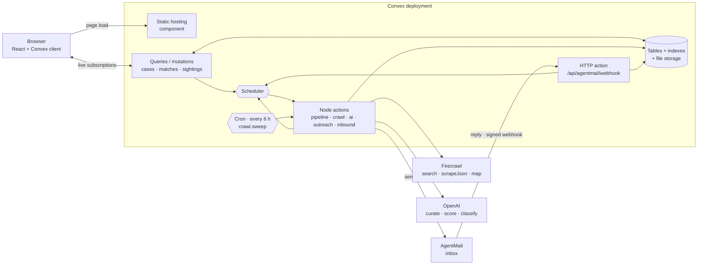
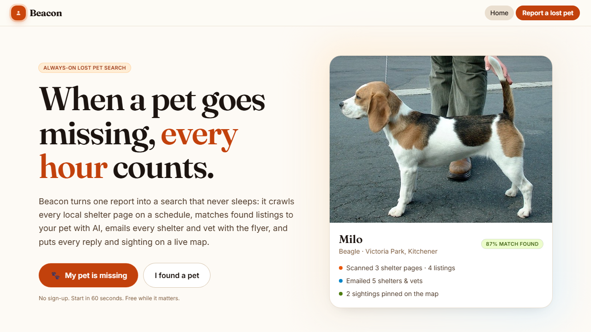
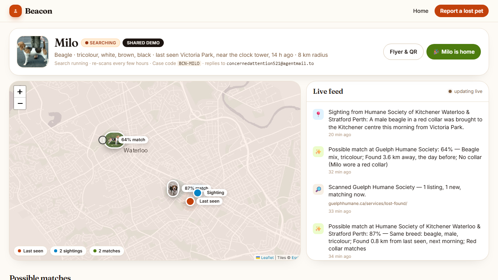
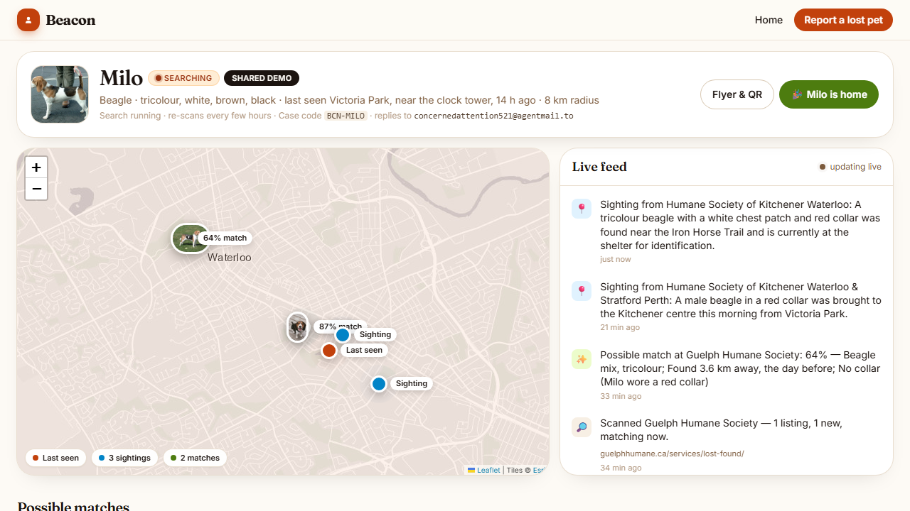
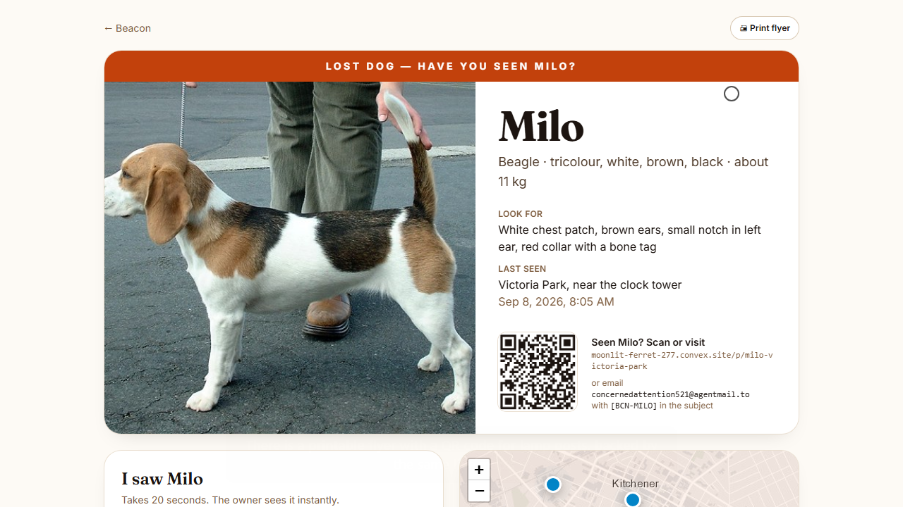

# 🐾 Beacon

**Your pet is missing. Beacon runs the search while you're out looking for them.**

🌐 **[Live demo](https://moonlit-ferret-277.convex.site)** · 🎥 Demo video: [Watch the demo](https://www.youtube.com/watch?v=MMXR0BWSom4) · 📓 [Build log](hackathon.md)

> The demo runs on the free tiers of Convex, OpenAI, Firecrawl and AgentMail, so under load some features may be rate-limited — the video shows the full flow.

## 🐶 What this is

Beacon is a website for people whose dog or cat has just gone missing. You fill in one short form — a photo, a few details, a pin on the map where you last saw them — and Beacon starts doing the phone-calling and page-refreshing for you. It finds the animal shelters, lost-and-found boards and vet clinics near you, emails every one of them a flyer, and then keeps re-reading their "found pets" pages looking for an animal that matches yours. Everything it learns lands on one live page: pins on a map, a running feed, and a list of possible matches with the reasons attached.

## 💔 The problem

The first 24 hours are the ones that matter, and they are the hours you have the least attention to spare. A pet goes missing and you are suddenly expected to find and phone eleven shelters, remember which ones you already called, check each of their "found animals" pages twice a day, print flyers, and answer every message from a stranger who thinks they saw something. Shelters do post found animals — often within hours — but nobody has the time to sit and refresh eleven web pages while also walking the neighbourhood shouting a name.

## 🔦 Our solution

1. **Report once.** A three-step form: photo, description, and a map pin with a search radius. No sign-up — opening the site signs you in.
2. **Beacon finds who to tell.** It searches the web for shelters, humane societies, lost-and-found boards and vets around your city, keeps the ones that are really local, and lifts a contact address off each site (following through to a contact page when the front page has none).
3. **Beacon emails them the flyer.** A real email, from a real inbox, with your pet's photo, description and a link back to a public flyer page. Each carries a short case code — `BCN-MILO` on the demo case.
4. **Beacon keeps watching.** Every found-animal listing on those pages is pulled out as structured data and scored against your pet: same breed, same colours, found 800 m away the next morning. Anything above 60% becomes a match card with its reasoning shown.
5. **Replies come back into the app.** When a shelter replies to the flyer, the reply is routed to your case, read, summarised, and — if it describes an animal — turned into a sighting pinned on your map. You never touch an inbox.
6. **Anyone who finds your pet can help.** The flyer page is public, printable, and carries a QR code. A stranger reports a sighting in twenty seconds, with a photo, without signing up.
7. **When they're home**, one button tells every shelter and vet you contacted to stand down.

## 🧰 How we used each sponsor

| Sponsor | What it does in Beacon | Where in the code |
|---|---|---|
| **Convex** | The entire backend: database + indexes, live-updating queries, mutations, Node actions, HTTP actions, scheduler, cron, file storage, auth, components, and the static hosting that serves the app itself | all of `convex/`, `convex/convex.config.ts`, `convex/http.ts` |
| **Firecrawl** | Finds the local shelters (search), extracts found-animal listings from their pages as JSON, and maps sites to locate contact pages | `convex/lib/firecrawl.ts`, `convex/crawl.ts` |
| **OpenAI** | Picks which search results are genuinely local rescues, scores every listing against the lost pet with reasons, and triages every inbound reply into sighting / no-match / question | `convex/lib/llm.ts`, `convex/ai.ts`, `convex/crawl.ts` |
| **AgentMail** | The app's own inbox: sends every flyer and thank-you, and receives every reply through a signed webhook that routes it back to the right case | `convex/lib/agentmail.ts`, `convex/mailActions.ts`, `convex/outreach.ts`, `convex/http.ts` |

### Convex

Convex is not a database Beacon happens to store rows in — it is the whole runtime.

- **Schema and indexes** — `convex/schema.ts` defines 14 tables (`cases`, `sources`, `listings`, `matches`, `contacts`, `sightings`, `events`, `mailMessages`, `senderRoutes`, `settings`, `usage`, `flags`, `crawlCache`, `crawlBudget`) on top of `authTables`, with 30 named indexes. Reads go through them: `by_case_status`, `by_slug`, `by_caseCode`, `by_case_email`, `by_day_provider`, `by_routed`.
- **Queries, live by default** — the war room (`src/pages/CaseRoom.tsx`) subscribes to seven queries at once (`cases.get`, `cases.feed`, `cases.matches`, `cases.sightings`, `cases.sources`, `cases.listings`, `cases.contacts`). Nothing polls. When a scrape three layers deep in an action inserts a match, the card slides onto the screen.
- **Mutations** — `cases.create`, `cases.markFound`, `cases.reopen`, `matches.setStatus`, `sightings.reportPublic`, plus the internal writers in `convex/store.ts` that the actions call.
- **Node actions** — everything that touches a sponsor SDK is a `"use node"` action: `pipeline.kickoff`, `crawl.scrapeSource`, `crawl.sweep`, `crawl.scanNow`, `ai.scoreListing`, `outreach.sendFlyers`, `outreach.sendFoundNotice`, `inbound.onInbound`, `mailActions.send`. Keys never leave the deployment.
- **HTTP actions** — `convex/http.ts` mounts the auth routes, then `POST /api/agentmail/webhook` (Svix signature verified in `convex/lib/svix.ts` with Web Crypto so it runs in the default runtime), then registers static hosting as the catch-all. The webhook stores and returns 200 immediately; all AI work is scheduled, so a slow model can never trigger a webhook retry storm.
- **Scheduler** — the backbone of the pipeline. `cases.create` schedules `pipeline.kickoff`; kickoff staggers the first scrape of each source 8 s apart to respect Firecrawl's per-minute limit; a rate-limited scrape reschedules itself 70 s later; each new listing schedules `ai.scoreListing` 1.5 s apart; `mail.ingest` schedules `inbound.onInbound`; confirming a match schedules `outreach.sendFoundNotice`.
- **Cron** — `convex/crons.ts` runs `crawl.sweep` every 6 hours to re-scrape the sources of every open case.
- **File storage** — pet photos and sighting photos are uploaded straight to Convex storage via `ctx.storage.generateUploadUrl()` (`cases.generateUploadUrl`, `sightings.generatePublicUploadUrl`) and read back with `ctx.storage.getUrl` in `store.photoUrlsFor`.
- **Convex Auth with anonymous sign-in** — `convex/auth.ts` registers `Anonymous` and `Password`. Opening the live URL signs you in silently (`src/auth.tsx`), so a judge never meets a login wall, and `getAuthUserId` still backs every ownership check in `cases.accessibleCase`. The `/admin` unrouted-mail view is deliberately restricted to accounts with a real email, because anonymous sign-in proves nothing.
- **Components** — registered in `convex/convex.config.ts`: `@convex-dev/static-hosting` serves the React app from the Convex deployment itself (`registerStaticRoutes`, plus `exposeDeploymentQuery` in `convex/staticHosting.ts`), and `@convex-dev/rate-limiter` enforces per-user *and* global budgets in `convex/lib/limits.ts` (`createCase`, `userCrawl`, `userLlm`, `publicReport`, `globalCrawl`, `globalSend`, `globalLlm`, `globalBurst`) so a public URL with anonymous sign-in cannot drain a free tier. `@convex-dev/agent` is also registered; Beacon's model calls go through `convex/lib/llm.ts` directly.

### Firecrawl

Firecrawl does the crawling *and* part of the extraction — `convex/lib/firecrawl.ts` is the only module that talks to it:

- `search()` — three queries per case (`"<city> animal shelter found animals stray intake"`, `"<city> lost and found pets"`, `"<city> veterinary clinic"`), with page markdown returned inline so the contact email can be lifted from the same result.
- `scrapeJson()` — a scrape *and* a schema-guided JSON extraction in one call: `LISTINGS_JSON_SCHEMA` in `convex/crawl.ts` asks for every found/stray animal with species, description, colours, location, date and image. Because Firecrawl runs the extraction, listings keep flowing even when our own model endpoint is down.
- `map()` + `scrape()` — when a shelter's front page has no email, `findContactEmail` maps the site, picks the contact/about page and scrapes it.
- Every call goes through one gateway with a permanent result cache (`crawlCache`) and a spend guard denominated in **credits**, checked against Firecrawl's own credit-usage endpoint (`convex/crawlCache.ts`). A judge repeating what an earlier judge did costs nothing.

### OpenAI

`convex/lib/llm.ts` is the only module that calls a model, and every call is wrapped by `llmGuarded` in `convex/ai.ts` (kill switch → rate limits → 10-minute circuit breaker → usage metering → 45 s deadline). Four jobs:

1. **Source curation** (`crawl.discover`) — given a dozen search hits, decide which are genuinely a local shelter, humane society, lost-and-found board or vet, name the organisation, and copy out any email in the page text.
2. **Listing extraction fallback** (`crawl.scrapeOne`) — when Firecrawl returns markdown but no JSON, the model extracts the listings from the markdown instead.
3. **Match scoring** (`ai.scoreListing`) — a 0-100 score plus up to three short reasons ("same breed", "found 0.8 km away, next morning"), with the pet photo and listing photo blended in when a vision model is configured. Structured output is enforced with a zod schema converted to JSON Schema.
4. **Reply triage** (`ai.classifyReply`) — every inbound email becomes `sighting` / `no_match` / `question` / `auto_reply` / `other`, a one-sentence summary for the feed, and a place name that gets geocoded into a map pin.

Each of the four has a deterministic fallback (`heuristicScore`, `heuristicClassify`) so the app degrades instead of breaking, and the row records which one ran.

### AgentMail

Beacon owns exactly one AgentMail inbox — **concernedattention521@agentmail.to** — created idempotently by `mailActions.ensureInbox`, and does per-case routing with a short code in the subject.

- **Outbound**: `outreach.flyer()` renders a real HTML flyer (photo, markings, last-seen, a link to the public flyer page) and `mailActions.send` sends it to every discovered shelter and vet, recording the message and thread id.
- **Inbound**: replies hit the Svix-signed webhook in `convex/http.ts` and are routed in `mail.ingest` by thread id → `[BCN-XXXX]` code in the subject → registered sender address, then classified and turned into a sighting pin.
- **Try it**: email `concernedattention521@agentmail.to` with `[BCN-MILO]` in the subject describing where you saw a beagle, and watch it appear on the demo case's live feed and map.
- Outbound sending fails closed: without an explicit `ALLOW_REAL_SENDS=1` (production) or a `DEMO_RECIPIENT_OVERRIDE` redirect address, `sendMail` refuses rather than emailing a real shelter from a dev box.

## ⚙️ How it works



The core loop, function by function:

1. `cases.create` (mutation) writes the case, logs the first feed event, and schedules `pipeline.kickoff`.
2. `pipeline.kickoff` (action) calls `crawl.discover`: Firecrawl `search` × 3 → OpenAI picks the real local orgs → `store.upsertSource` / `store.upsertContact`.
3. Still in kickoff, `outreach.sendFlyersFor` sends each contact the flyer through `mailActions.send`, then the first scrape of every source is scheduled 8 s apart.
4. `crawl.scrapeSource` → `firecrawl.scrapeJson` returns found-animal listings as JSON → `store.upsertListing` → each new listing schedules `ai.scoreListing`.
5. `ai.scoreListing` scores the listing against the case; anything ≥ 60 becomes a `matches` row and a feed event — which appears in the open browser instantly, because `cases.matches` is a live query.
6. A shelter replies → AgentMail webhook → `mail.ingest` routes it → `inbound.onInbound` classifies it, geocodes the place with `lib/geo.ts`, and `store.applyClassification` inserts a `sightings` row that becomes a map pin.
7. The owner clicks **This is them!** → `matches.setStatus` flips the case to found and schedules `outreach.sendFoundNotice`, which emails every contact that the pet is home.
8. Meanwhile the cron fires `crawl.sweep` every 6 hours and the whole loop repeats for every open case.

## 📸 Screenshots

| | |
|---|---|
|  |  |
| **Landing** — one button, no sign-up. | **The war room** — map, live feed and match cards on one page. |
|  |  |
| **A reply becomes a pin** — an emailed sighting classified, geocoded and added to the map while the page is open. | **The public flyer** — printable, QR-coded, with a 20-second sighting form anyone can use. |

## 🛠 Running it yourself

```bash
pnpm install
pnpm exec convex dev          # writes CONVEX_DEPLOYMENT + VITE_CONVEX_URL to .env.local
pnpm dev                      # Vite dev server
pnpm run build && pnpm run deploy   # build, then publish to Convex static hosting
```

Set these on the Convex deployment with `convex env set NAME value` — never in the repo. Names only:

| Variable | For |
|---|---|
| `JWT_PRIVATE_KEY`, `JWKS`, `SITE_URL` | Convex Auth |
| `LLM_BASE_URL`, `LLM_API_KEY`, `LLM_MODEL`, `LLM_VISION_MODEL` | OpenAI |
| `FIRECRAWL_API_KEY` | Firecrawl |
| `AGENTMAIL_API_KEY`, `AGENTMAIL_WEBHOOK_SECRET` | AgentMail |
| `DEMO_RECIPIENT_OVERRIDE`, `ALLOW_REAL_SENDS`, `APP_PAUSED` | Send safety and the kill switch |

Then `pnpm exec convex run seed:run` to create the shared **Milo** demo case. See `.env.example`.

## 🙏 Credits

Built for the **Convex All Gas Hackathon**, sponsored by OpenAI, Firecrawl and AgentMail.

Convex (database, functions, scheduler, crons, file storage, auth, static hosting, rate-limiter component) · Firecrawl (search, scrape, JSON extraction, map) · OpenAI (curation, matching, reply triage) · AgentMail (the inbox) · React 19, Vite, Tailwind CSS v4 · Leaflet with Esri light-grey basemap tiles · OpenStreetMap Nominatim for geocoding.
